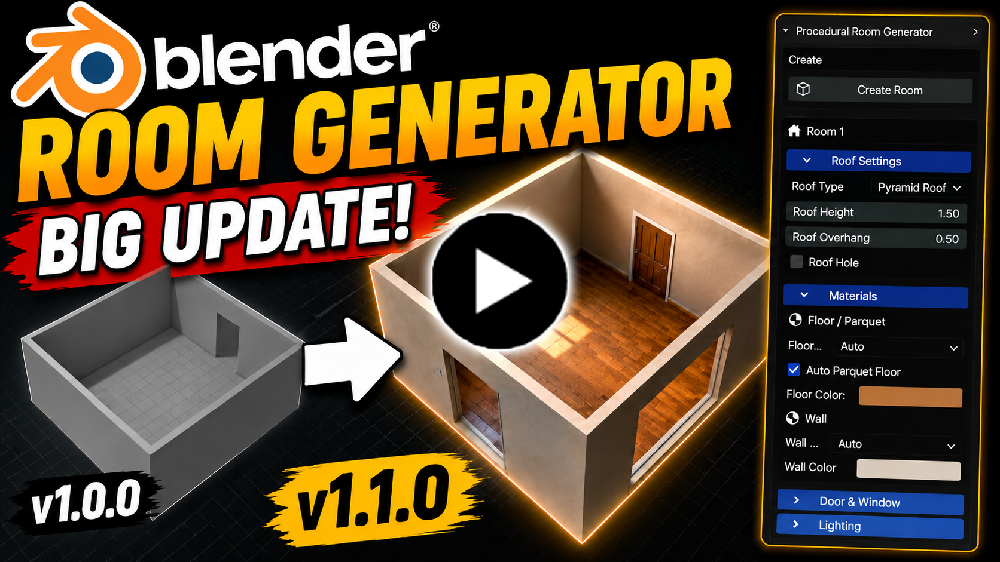
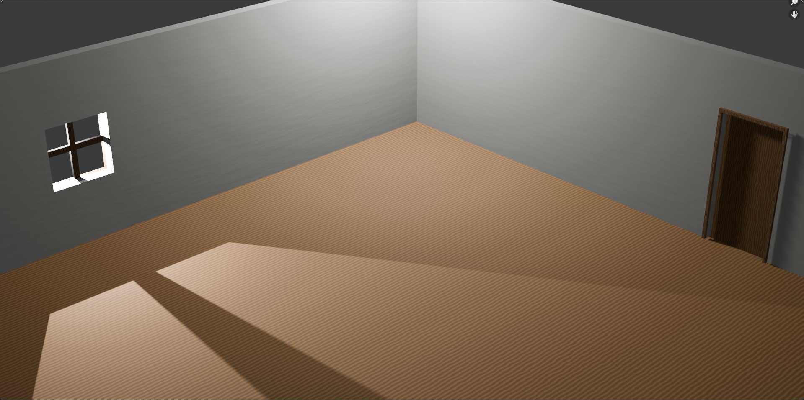
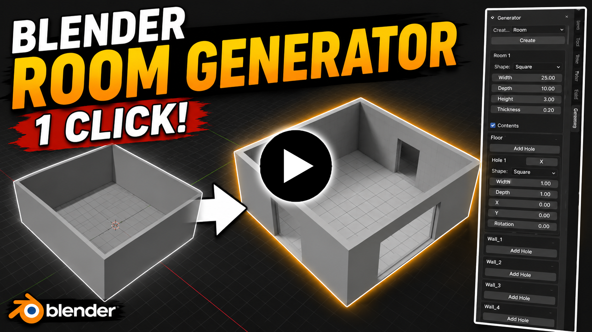
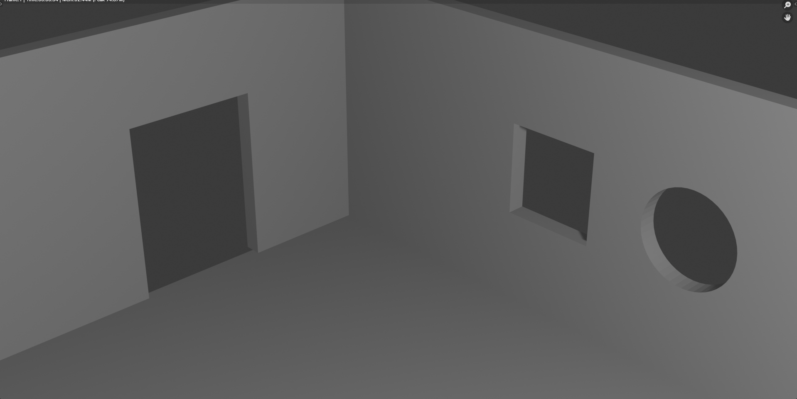

# Procedural Room Generator


<p>
&nbsp;&nbsp;&nbsp;&nbsp;&nbsp;&nbsp;&nbsp;&nbsp;&nbsp;&nbsp;&nbsp;&nbsp;&nbsp;&nbsp;&nbsp;&nbsp;&nbsp;&nbsp;&nbsp;&nbsp;&nbsp;&nbsp;&nbsp;&nbsp;&nbsp;&nbsp;&nbsp;&nbsp;&nbsp;&nbsp;&nbsp;&nbsp;&nbsp;&nbsp;&nbsp;&nbsp;&nbsp;&nbsp;&nbsp;&nbsp;&nbsp;&nbsp;&nbsp;&nbsp;&nbsp;&nbsp;


&nbsp;&nbsp;&nbsp;&nbsp;&nbsp;&nbsp;&nbsp;&nbsp;&nbsp;&nbsp;&nbsp;&nbsp;&nbsp;&nbsp;&nbsp;&nbsp;&nbsp;&nbsp;&nbsp;&nbsp;&nbsp;&nbsp;&nbsp;&nbsp;&nbsp;&nbsp;&nbsp;&nbsp;&nbsp;&nbsp;&nbsp;&nbsp;&nbsp;&nbsp;&nbsp;&nbsp;&nbsp;&nbsp;&nbsp;&nbsp;&nbsp;&nbsp;&nbsp;&nbsp;&nbsp;&nbsp;

</p>

Create editable procedural rooms in Blender in under 1 minute.

A Blender add-on for generating editable procedural rooms with customizable walls, floors, roofs, openings, frames, lighting, and materials.

---

## Downloads

### Latest Version (Recommended)
- [Download v1.1.0](../../releases/tag/v1.1.0)

### Older Versions
- [Download v1.0.0](../../releases/tag/v1.0.0)

---

# Changelog

# v1.1.0

## 🎥 V1.1.0 Showcase Video

<p align="center">
  <a href="https://www.youtube.com/watch?v=7XABYS6gubk">
    
  </a>
</p>

<p align="center">
  ▶ Click the image to watch the showcase
</p>

## New Features
- Roof System
- Pyramid Roof
- Cone Roof
- Door Frames
- Window Frames
- Procedural Doors
- Window Lighting
- Procedural Materials
- Material Customization
- Custom Material Colors
- Smoothness & Metallic Controls

## Improvements
- Better procedural room workflow
- Improved room customization
- Better procedural generation
- Improved lighting system
- Better room visuals
- More realistic room creation

You can now create rooms like this in under 1 minute.

### Example (v1.1)



🔗 [See v1.1 Code](./procedural_room_generator_v1_1.py)

---

# v1.0.0

## 🎥 V1.0.0 Showcase Video

<p align="center">
  <a href="https://www.youtube.com/watch?v=IJL7FhvlWYg">
    
  </a>
</p>

<p align="center">
  ▶ Click the image to watch the showcase
</p>

## New Features
- Editable Procedural Room Generation
- Custom Room Width, Depth & Height
- Wall Thickness Customization
- Floor Openings
- Wall Openings
- Multiple Opening Shapes
- Real-Time Room Updates

## Improvements
- Faster room creation workflow
- Easier procedural room editing
- Editable procedural system

Basic procedural room generation.

### Example (v1.0)



🔗 [See v1.0 Code](./procedural_room_generator_v1_0.py)

---

## Installation

1. Download the `.py` file
2. Open Blender
3. Go to:

```text
Edit > Preferences > Add-ons > Install
```

4. Select the downloaded `.py` file  
5. Enable the add-on

---

## Requirements

- Blender 4.0+
- Python (included with Blender)

---

## License

This project is licensed under the MIT License.

---

# Connect With Me

<p align="center">
  <a href="https://github.com/KuzeyKayraEyioglu">
    
  </a>
  
  <a href="https://www.youtube.com/@KuzeyKayraEyio%C4%9Flu">
    
  </a>
</p>

<p align="center">
  <a href="https://github.com/KuzeyKayraEyioglu">GitHub</a>
  &nbsp;&nbsp;&nbsp;&nbsp;&nbsp;&nbsp;&nbsp;&nbsp;
  <a href="https://www.youtube.com/@KuzeyKayraEyio%C4%9Flu">YouTube</a>
</p>

---

## Author

Created by **Kuzey Kayra Eyioğlu**

- Interests: Programming, Blender Add-ons, Game Development, Robotics
